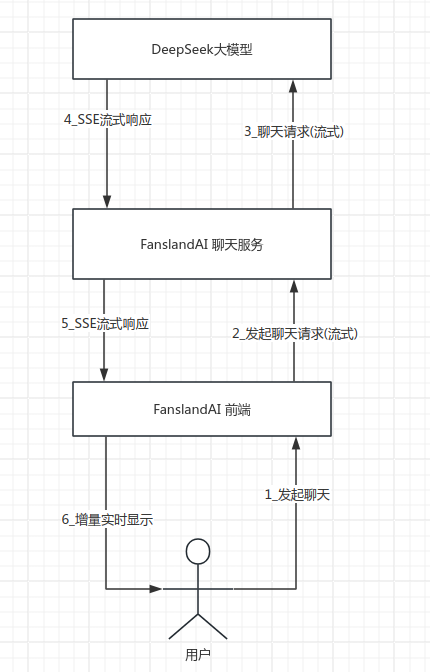

# aichat

SSE(Server-Sent Event)聊天服务

> Server-Sent Events（SSE）是一种用于实现服务器向客户端实时推送数据的 Web 技术。与传统的轮询和长轮询相比，SSE 提供了更高效和实时的数据推送机制。
> SSE 基于 HTTP 协议，允许服务器将数据以事件流（Event Stream）的形式发送给客户端。客户端通过建立持久的 HTTP 连接，并监听事件流，可以实时接收服务器推送的数据。
> SSE 的主要特点
>
> -   简单易用：SSE 使用基于文本的数据格式，如纯文本、JSON 等，使得数据的发送和解析都相对简单。
> -   **单向通信**：SSE 支持服务器向客户端的单向通信，服务器可以主动推送数据给客户端，而客户端只能接收数据。

使用 deepseek 作为 AI 聊天大模型， deepseek 性价比非常高

-   DeepSeek API 文档: https://platform.deepseek.com/api-docs/zh-cn/
-   DeepSeek 开发者平台： https://platform.deepseek.com/

## 数据流



## 启动服务

-   新建`.env`文件, 设置 `DEEPSEEK_API_KEY`

-   启动服务：

```
go run main.go
```

-   启动客户端(非流式), 需要一直等待全部完成:

让 ai 写一首诗

```
curl -s -N -X POST localhost:8080/chat --data '
{
    "msg":"Please write a poem about your kingdom"
}' | jq  --unbuffered

```

响应示例：

```json
{
    "id": "7380f171-c05d-43bf-a6f4-56138356a8ba",
    "role": "assistant",
    "msgBuf": "In a land where dreams take flight,\nLies my kingdom, pure and bright.\nA butterfly's gentle wings,\nShaped our realm, where wonders sing.\n\nGolden fields of shimmering grace,\nWhere the rivers softly trace\nPatterns of the stars above,\nIn this haven, peace is love.\n\nThe barrier's power, strong and true,\nKeeps our secrets safe from view.\nYet within, the heart's content,\nWhere every soul is heaven-sent.\n\nLush gardens bloom with every hue,\nWhispering tales of ancient blue.\nMountains rise in emerald green,\nGuarding secrets, yet unseen.\n\nIn the heart of this butterfly,\nLives a people, kind and free.\nWith laughter bright and songs so sweet,\nIn our kingdom, joy we greet.\n\nSo come, dear friend, let's take a stroll,\nThrough the land where dreams unroll.\nIn the butterfly's gentle hold,\nFind a peace that's never old.",
    "delta": "",
    "finish": true
}
```

-   启动客户端（流式）, 立即响应

```
curl -s -N -X POST localhost:8080/chat-stream --data '
{
    "msg":"Please write a poem about your kingdom"
}' | jq  --unbuffered
```

---
